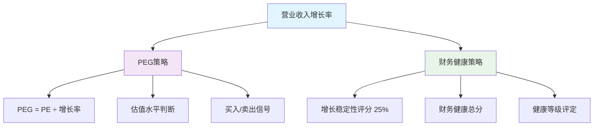

# 📊 交互式策略详情功能

## 🎯 功能概述

为了提供更深入的量化分析体验，系统现已支持**PEG策略**和**财务健康策略**的交互式详情查看功能，用户可以点击相应策略标签查看详细的计算逻辑、数值组成和投资建议。

## ✨ 功能特性

### 1. PEG策略详情弹窗

#### 🔍 核心信息展示
- **PEG指标值**：显著展示PEG数值和估值水平
- **组成数据**：PE市盈率、营收增长率、市值规模、所属行业
- **计算公式**：PEG = PE率 ÷ 增长率

#### 📈 投资分析框架
```
估值水平分析：
├── PEG < 0.5    → 严重低估 (强烈买入)
├── 0.5 ≤ PEG < 1.0 → 低估 (买入)  
├── 1.0 ≤ PEG < 1.5 → 合理 (持有)
├── 1.5 ≤ PEG < 2.0 → 高估 (卖出)
└── PEG ≥ 2.0    → 严重高估 (强烈卖出)
```

#### 🧠 投资逻辑说明
- **理论基础**：彼得·林奇的经典指标
- **适用场景**：成长型公司估值分析
- **核心优势**：综合考虑估值和成长性
- **使用限制**：不适用于负增长公司

### 2. 财务健康策略增强

#### 💡 详细计算逻辑展示

**资产负债率 (30%权重)**
```
计算公式: 资产负债率 = (负债总计 ÷ 资产总计) × 100%
风险评估: 负债率越低，财务风险越小，健康程度越高
```

**ROE收益率 (25%权重)**  
```
计算公式: ROE = (净利润 ÷ 股东权益) × 100%
盈利能力: ROE越高，表示公司使用股东资金创造利润的能力越强
```

**增长稳定性 (25%权重)**
```
计算公式: 增长率 = ((本期营收 - 同期营收) ÷ 同期营收) × 100%
成长性: 正向增长表示公司业务扩张，增长率越高越好
数据周期: 优先使用季度同比/半年度同比数据
```

**市值规模 (20%权重)**
```
计算公式: 市值 = 股价 × 流通股本
规模效应: 大市值公司通常具有更强的抗风险能力和稳定性
```

## 🎨 用户界面设计

### PEG策略弹窗结构
```
┌─────────────────────────────────┐
│ PEG策略详情                      │
├─────────────────────────────────┤
│ 📊 PEG指标: 1.23 (合理)          │
│ 📐 计算公式: PEG = PE率 ÷ 增长率   │
│ 📋 组成数据: PE/增长率/市值/行业   │
│ 📈 投资分析: 估值水平/投资逻辑     │
│ 🎯 策略结论: 投资建议/分析原因     │
└─────────────────────────────────┘
```

### 财务健康弹窗增强
```
┌─────────────────────────────────┐
│ 财务健康策略详情                  │
├─────────────────────────────────┤
│ 🏆 综合健康评分: 78.5/100        │
│ 📊 评分细分:                    │
│   ├── 资产负债率: 35% → 20/30分   │
│   │   └── 💡 计算逻辑 + 风险评估   │
│   ├── ROE收益率: 18% → 20/25分    │
│   │   └── 💡 计算逻辑 + 盈利评估   │
│   ├── 增长稳定性: 12% → 20/25分   │
│   │   └── 💡 计算逻辑 + 数据周期   │
│   └── 市值规模: 1200亿 → 20/20分  │
│       └── 💡 计算逻辑 + 规模效应   │
└─────────────────────────────────┘
```

## 🔧 技术实现

### 前端交互设计
```javascript
// PEG策略点击处理
const showPEGDetail = (stock) => {
  selectedStock.value = stock;
  showPEGModal.value = true;
};

// 财务健康策略点击处理  
const showFinancialHealthDetail = (stock) => {
  selectedStock.value = stock;
  showHealthModal.value = true;
};
```

### 后端数据增强
```python
# PEG策略返回更详细信息
return {
    "peg_value": round(peg_value, 2),
    "pe_ratio": pe_ratio,
    "growth_rate": growth_rate,
    "calculation_detail": {
        "formula": "PEG = PE率 ÷ 增长率",
        "pe_explanation": "市盈率，反映市场对公司的估值水平",
        "growth_explanation": "营业收入增长率，反映公司的成长性"
    }
}
```

### 样式设计要点
- **响应式布局**：适配不同屏幕尺寸
- **颜色区分**：买入/卖出/持有信号使用不同颜色
- **视觉层次**：通过字体大小和颜色突出重要信息
- **交互反馈**：hover效果和点击提示

## 📱 使用指南

### 操作步骤
1. **添加股票**：在搜索框输入股票代码
2. **查看策略**：在策略分析结果中找到目标策略
3. **点击详情**：点击带有💡标识的策略项
4. **深入分析**：在弹窗中查看详细计算和逻辑
5. **关闭弹窗**：点击关闭按钮或弹窗外部区域

### 实用提示
- **💡 图标**：表示该策略支持详情查看
- **hover效果**：鼠标悬停时显示"点击查看详情"
- **数据时效性**：弹窗显示数据更新时间和来源
- **计算透明**：所有指标都显示具体计算公式

## 🎯 价值意义

### 投资决策支持
1. **透明化分析**：清晰展示每个指标的计算过程
2. **教育价值**：帮助用户理解量化投资逻辑  
3. **风险评估**：详细说明各项指标的风险含义
4. **决策依据**：提供完整的投资建议依据

### 系统优势
1. **专业性**：基于成熟的量化投资理论
2. **实用性**：结合A股市场特点和数据特征
3. **易用性**：直观的界面设计和交互体验
4. **及时性**：使用最新的季度和半年度数据

---

## 📋 营业收入增长率的影响链条



**核心影响说明**：
- **PEG策略**：增长率直接影响PEG计算，是核心分母
- **财务健康**：增长率占25%权重，影响总体健康评分
- **数据来源**：优先使用季度同比数据，提升时效性

---

**更新时间**: 2025-09-15  
**版本**: v1.0  
**功能状态**: ✅ 已实现并测试